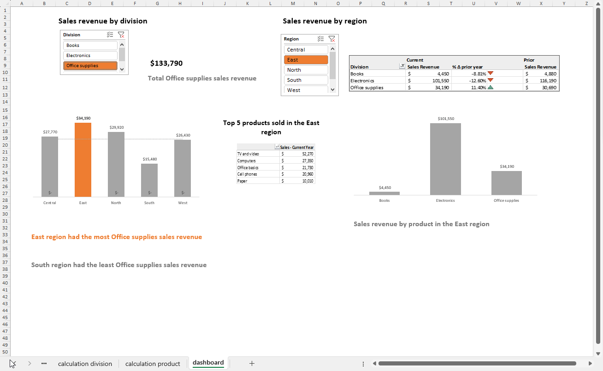
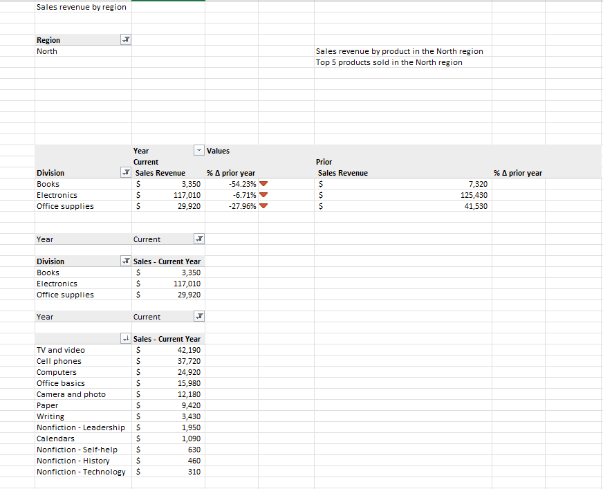

# Sales-Analysis

Obtained a superstores data set based on retail transactions. The data set contains more than 1,000 sales transaction records from 2020 through 2021. Each sales record contains information on product, region, division, and more.

## Objectives

> - Clean the data in the data set by analyzing an Excel pivot table
> - Create an interactive dashboard to analyze the data

#### Download the Sales-Analysis.xlsx to view the excel file and select the sheet named 'dashboard'

# Interactive dashboard

## Raw data

## Calculations

## Sales by division

